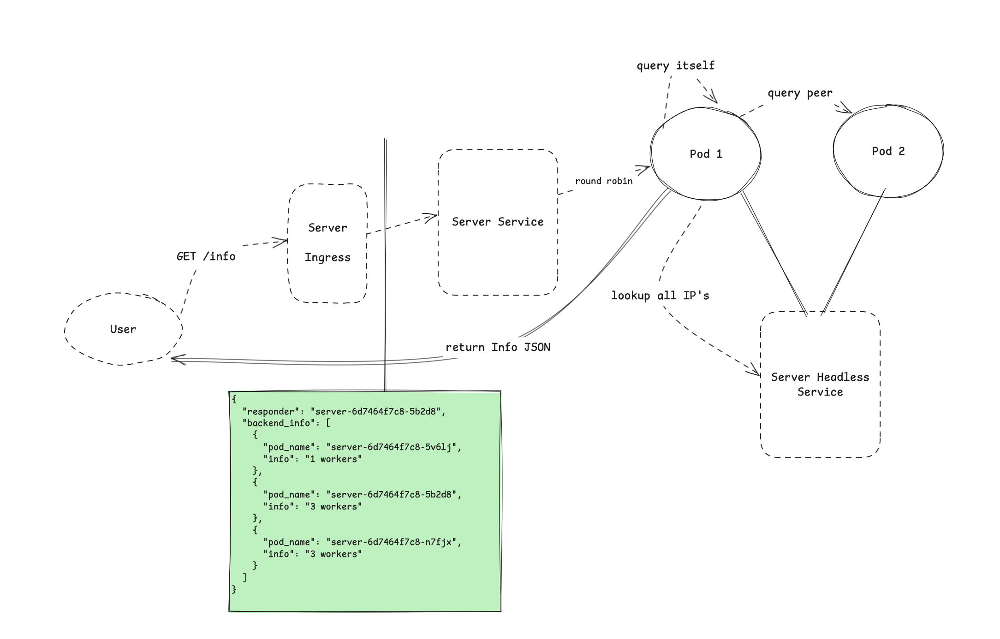

# headless-service-querier

This project has two components that can be started with flags. A "server" and a "querier".

The server exposes a worker count through a endpoint. 
The queriers job is then to lookup all IPs of the backing pods and gather the worker count from all the pods.

- `pinger` contains the code that lookups the IPs and pings the endpoints
- `server` contains the code that exposes a endpoint to return worker information (name of worker & random worker count)
- `deploy` contains the k8s manifests to deploy these components
- `deploy-server-only` contains the k8s manifests that deploys this with a server only component

## Architecture

## Getting started

- You need docker, kind & kubectl installed 

To run it: 

`make run` & then use kubectl to explore the default namespace.

To tear it down: 

`make teardown` - this removes the kind cluster. 
